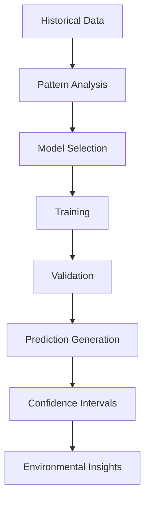

# BloomTracker Backend

A FastAPI-based backend service for processing and serving geospatial data from multiple satellite and climate data sources.

## 🌍 Overview

BloomTracker is designed to process heterogeneous geospatial datasets and convert them into structured, machine-readable JSON/GeoJSON format. The backend handles three main data sources:

- **MODIS Terra Vegetation Indices** (.hdf files) - Vegetation monitoring data
- **MERRA-2 Climate Data** (.nc files) - Atmospheric reanalysis data
- **ALOS PALSAR Terrain Data** (.tif, .kmz, .xml files) - Synthetic Aperture Radar data

## 🏗️ Project Structure

```
BloomTracker/
└── backend/
    ├── main.py                    # FastAPI application entry point
    ├── requirements.txt           # Python dependencies
    ├── README.md                  # This documentation
    ├── logs/                      # Application logs directory
    ├── data_loaders/              # Data processing modules
    │   ├── __init__.py
    │   ├── modis_loader.py        # MODIS HDF file processor
    │   ├── merra_loader.py        # MERRA-2 NetCDF file processor
    │   └── alos_loader.py         # ALOS PALSAR terrain data processor
    └── Data/                      # Geospatial data directory
        ├── MODIS Terra Vegetation Indices/
        ├── MERRA-2 const_2d_lnd_Nx/
        └── ALOS PALSAR High Resolution Radiometric Terrain/
```

## 🚀 Quick Start

### Prerequisites

- Python 3.8 or higher
- pip (Python package installer)

### Installation

1. **Clone or navigate to the project directory:**

   ```bash
   cd backend
   ```

2. **Install dependencies:**

   ```bash
   pip install -r requirements.txt
   ```

3. **Set up environment variables:**

   ```bash
   python setup_env.py
   ```

4. **Configure your API keys:**

   Edit the `.env` file and set your DeepSeek API key:
   ```bash
   DEEPSEEK_API_KEY=your_actual_deepseek_api_key_here
   ```

5. **Run the application:**

   ```bash
   python main.py
   ```

6. **Access the API:**
   - API Documentation: http://localhost:8000/docs
   - Alternative Documentation: http://localhost:8000/redoc
   - Health Check: http://localhost:8000/health

## 📊 API Endpoints

### Core Endpoints

| Endpoint          | Method | Description                             |
| ----------------- | ------ | --------------------------------------- |
| `/`               | GET    | API information and available endpoints |
| `/health`         | GET    | Health check endpoint                   |
| `/data/modis`     | GET    | Process MODIS vegetation indices data   |
| `/data/merra`     | GET    | Process MERRA-2 climate data            |
| `/data/alos`      | GET    | Process ALOS PALSAR terrain data        |
| `/data/all`       | GET    | Process all available data sources      |
| `/predict/modis`  | GET    | Predict vegetation index trends         |
| `/predict/merra`  | GET    | Predict climate variables               |
| `/predict/alos`   | GET    | Predict terrain changes                 |
| `/predict/all`    | GET    | Multi-source predictions                |
| `/predict/train`  | POST   | Train and save models                   |
| `/predict/models` | GET    | List saved models                       |

### Response Format

All data endpoints return responses in the following format:

```json
{
  "success": true,
  "data": {
    "description": "...",
    "files": [...],
    "total_files": 3,
    "data_type": "..."
  },
  "metadata": {
    "source": "...",
    "file_type": "...",
    "processed_files": 3
  },
  "message": "Data processed successfully"
}
```

## 🔮 Prediction API

BloomTracker now includes a comprehensive predictive analytics system that forecasts future geospatial and environmental trends using time-series data from MODIS, MERRA-2, and ALOS PALSAR datasets. The system employs advanced machine learning models with intelligent fallback mechanisms to ensure reliable predictions.

### Prediction Endpoints

| Endpoint          | Method | Description                                                                                       |
| ----------------- | ------ | ------------------------------------------------------------------------------------------------- |
| `/predict/modis`  | GET    | Predicts vegetation index trends (NDVI, EVI) from MODIS HDF data                                  |
| `/predict/merra`  | GET    | Predicts future climate variables (temperature, humidity, soil moisture) from MERRA-2 NetCDF data |
| `/predict/alos`   | GET    | Estimates terrain reflectivity or surface changes from ALOS PALSAR time-ordered data              |
| `/predict/all`    | GET    | Combines all datasets for a unified multi-source forecast                                         |
| `/predict/train`  | POST   | Forces model retraining and saves updated versions                                                |
| `/predict/models` | GET    | Lists all saved models with metadata                                                              |

### 🤖 Machine Learning Models

The prediction system supports three sophisticated machine learning models with intelligent automatic selection and fallback mechanisms:

#### **ARIMA (AutoRegressive Integrated Moving Average)**

- **Best For**: Stationary time series with clear trends
- **Strengths**: Fast training, interpretable results, works with small datasets
- **Use Cases**: Short-term vegetation monitoring, climate variable forecasting
- **Mathematical Foundation**: Combines autoregression, differencing, and moving averages
- **Availability**: ✅ Always available (statsmodels library)

#### **Prophet (Facebook's Forecasting Tool)**

- **Best For**: Seasonal data with holidays and events
- **Strengths**: Handles missing data, robust to outliers, automatic seasonality detection
- **Use Cases**: Long-term environmental monitoring, seasonal crop predictions
- **Mathematical Foundation**: Additive model with trend, seasonality, and holiday components
- **Availability**: ❌ Requires Prophet library installation

#### **LSTM (Long Short-Term Memory Neural Networks)**

- **Best For**: Complex patterns and long-term dependencies
- **Strengths**: Captures non-linear relationships, handles multivariate data
- **Use Cases**: Complex environmental systems, multi-variable climate modeling
- **Mathematical Foundation**: Recurrent neural networks with memory gates
- **Availability**: ❌ Requires TensorFlow/Keras installation

### 🧠 Intelligent Model Selection

The system automatically selects the optimal model based on data characteristics:

```python
# Automatic Model Selection Logic
if n_samples < 10 and ARIMA_AVAILABLE:
    return "arima"  # ARIMA works with small datasets
elif n_samples >= 30 and LSTM_AVAILABLE and not is_stationary:
    return "lstm"  # LSTM for complex patterns with sufficient data
elif has_seasonality and PROPHET_AVAILABLE:
    return "prophet"  # Prophet for seasonal data
elif ARIMA_AVAILABLE:
    return "arima"  # ARIMA as fallback
```

### 🔄 Smart Fallback System

When requested models are unavailable, the system gracefully falls back to working alternatives:

- **LSTM Requested + Not Available** → Falls back to ARIMA
- **Prophet Requested + Not Available** → Falls back to ARIMA
- **ARIMA Requested + Not Available** → Falls back to Prophet
- **Auto Model Selection** → Intelligently chooses best available model

### 📊 Model Performance Characteristics

| Model   | Training Speed | Prediction Accuracy | Data Requirements | Interpretability |
| ------- | -------------- | ------------------- | ----------------- | ---------------- |
| ARIMA   | ⚡ Fast        | 🎯 Good             | 📊 Small (3+)     | 🔍 High          |
| Prophet | 🐌 Medium      | 🎯 Excellent        | 📊 Medium (10+)   | 🔍 Medium        |
| LSTM    | 🐌 Slow        | 🎯 Excellent        | 📊 Large (30+)    | 🔍 Low           |

### 🌍 Environmental Prediction Concepts

#### **What is Data Prediction?**

Data prediction is a machine learning technique that uses historical data to forecast future values or trends. It's based on the fundamental principle that **patterns in past data can help us understand what might happen next**.

#### **Core Prediction Concepts**

1. **Time Series Analysis**: Analyzing data points collected over time to identify patterns
2. **Pattern Recognition**: Detecting trends, seasonality, cycles, and noise in data
3. **Mathematical Modeling**: Using statistical and machine learning models to capture relationships
4. **Forecasting**: Extrapolating future values based on learned patterns

#### **Environmental Applications in BloomTracker**

- **Vegetation Health**: Predicting NDVI/EVI trends for crop monitoring and ecosystem health
- **Climate Variables**: Forecasting temperature, humidity, and soil moisture for agricultural planning
- **Surface Changes**: Estimating terrain reflectivity and land use changes from radar data
- **Multi-Source Integration**: Combining satellite, climate, and radar data for comprehensive environmental forecasting

### 📈 Prediction Workflow



### 🔬 Model Selection Criteria

The system automatically chooses the best model based on:

| Data Characteristic          | Recommended Model | Reason                           |
| ---------------------------- | ----------------- | -------------------------------- |
| Small dataset (< 10 samples) | ARIMA             | Works with minimal data          |
| Seasonal patterns            | Prophet           | Handles seasonality and holidays |
| Complex non-linear patterns  | LSTM              | Captures intricate relationships |
| Stationary time series       | ARIMA             | Optimal for linear trends        |
| Large dataset (30+ samples)  | LSTM              | Benefits from deep learning      |

### Example Prediction Requests

```bash
# Predict MODIS vegetation trends with Prophet
curl -X GET "http://localhost:8000/predict/modis?model=prophet&steps=10"

# Predict MERRA-2 climate variables with LSTM
curl -X GET "http://localhost:8000/predict/merra?model=lstm&steps=7"

# Auto-select best model for multi-source prediction
curl -X GET "http://localhost:8000/predict/all?model=auto&steps=5"

# Force model retraining
curl -X POST "http://localhost:8000/predict/train?dataset=merra&model=prophet"

# Get model availability status
curl -X GET "http://localhost:8000/predict/models"
```

### Example Prediction Response

```json
{
  "success": true,
  "data": {
    "predicted_values": [292.1, 292.3, 292.7, 292.9, 293.0],
    "timestamps": [
      "2025-10-05",
      "2025-10-06",
      "2025-10-07",
      "2025-10-08",
      "2025-10-09"
    ],
    "model_used": "Prophet",
    "source": "MERRA-2 Climate Data"
  },
  "metadata": {
    "processed_files": 3,
    "confidence": 0.91,
    "training_samples": 40
  },
  "message": "5-step forecast generated successfully using Prophet model."
}
```

### 🏗️ Prediction System Architecture

#### **Core Components**

1. **PredictiveModel Class**: Core forecasting engine supporting ARIMA, Prophet, and LSTM models
2. **TimeSeriesPredictor**: Integrates with data loaders to extract time-series data for forecasting
3. **ModelManager**: Handles persistent storage, loading, and management of trained models

#### **Machine Learning Pipeline**

```python
# 1. Data Extraction
time_series_data = extract_temporal_data(geospatial_files)

# 2. Model Selection
best_model = select_optimal_model(data_characteristics)

# 3. Training
trained_model = train_model(historical_data, target_variables)

# 4. Prediction
future_forecasts = generate_predictions(trained_model, forecast_steps)

# 5. Persistence
save_model(trained_model, metadata)
```

### 🌱 Dataset-Specific Predictions

#### **MODIS Predictions**

- **Data Source**: Vegetation indices (NDVI, EVI) from satellite imagery
- **Prediction Target**: Future vegetation health and growth patterns
- **Applications**: Crop monitoring, ecosystem health assessment, drought detection
- **Temporal Resolution**: 16-day intervals
- **Spatial Coverage**: Global with 250m resolution

#### **MERRA-2 Predictions**

- **Data Source**: Climate variables from atmospheric reanalysis
- **Prediction Target**: Temperature, humidity, soil moisture, atmospheric pressure
- **Applications**: Weather forecasting, agricultural planning, climate monitoring
- **Temporal Resolution**: Daily
- **Spatial Coverage**: Global with 0.5° × 0.625° resolution

#### **ALOS PALSAR Predictions**

- **Data Source**: Radar backscatter from synthetic aperture radar
- **Prediction Target**: Surface changes, terrain reflectivity, land use changes
- **Applications**: Flood monitoring, deforestation tracking, urban development
- **Temporal Resolution**: Variable (mission-dependent)
- **Spatial Coverage**: Regional with high resolution

### 🔧 Model Management System

#### **Persistent Storage**

- Models automatically saved to `models/saved_models/`
- Metadata tracking for model versions and performance
- Automatic model freshness checking
- Configurable retraining intervals

#### **Model Lifecycle**

```python
# Model Training
model = PredictiveModel(model_type="auto")
training_results = model.train(data, target_column)

# Model Persistence
model_manager.save_model(model, metadata)

# Model Loading
loaded_model = model_manager.load_model(dataset, model_type)

# Model Retraining
if model_needs_retraining():
    retrain_model_with_new_data()
```

#### **Performance Monitoring**

- Training accuracy metrics
- Prediction confidence intervals
- Model validation scores
- Data quality assessments

### 🎯 Real-World Applications

#### **Agricultural Planning**

- **Crop Yield Prediction**: Forecast harvest quantities and timing
- **Irrigation Scheduling**: Predict optimal watering times
- **Pest Management**: Anticipate pest outbreaks based on environmental conditions

#### **Environmental Monitoring**

- **Drought Early Warning**: Predict water scarcity conditions
- **Ecosystem Health**: Monitor biodiversity and habitat changes
- **Climate Change**: Track long-term environmental trends

#### **Disaster Management**

- **Flood Prediction**: Anticipate flood risks from radar data
- **Wildfire Risk**: Predict fire-prone conditions
- **Landslide Monitoring**: Detect terrain stability changes

## 🔧 Data Processing Details

### MODIS Terra Vegetation Indices (.hdf files)

**Library Used:** `h5py` for HDF5 file reading

**Data Extracted:**

- NDVI (Normalized Difference Vegetation Index)
- EVI (Enhanced Vegetation Index)
- Reflectance bands (Red, NIR, Blue, MIR)
- Quality assurance layers
- Spatial and temporal metadata

**Processing Features:**

- Statistical analysis of vegetation indices
- Quality layer interpretation
- Band-specific statistics
- Fill value handling

### MERRA-2 Climate Data (.nc files)

**Library Used:** `xarray` and `netCDF4` for NetCDF file processing

**Data Extracted:**

- Climate variables (temperature, humidity, pressure, etc.)
- Temporal information (time series data)
- Spatial coordinates (latitude, longitude)
- Variable attributes and units

**Processing Features:**

- Multi-dimensional data handling
- Coordinate system extraction
- Temporal analysis
- Variable statistics

### ALOS PALSAR Terrain Data (Multiple formats)

**Libraries Used:**

- `rasterio` for TIF files
- `zipfile` for KMZ files
- `xml.etree.ElementTree` for XML files
- `PIL` for image files

**File Types Processed:**

- **TIF files:** Geospatial raster data with coordinate information
- **KMZ files:** Compressed KML files with embedded imagery
- **XML files:** Metadata and configuration files
- **JPG files:** Georeferenced imagery
- **WLD files:** World files for georeferencing

**Processing Features:**

- Bounding box extraction
- Coordinate system detection
- Band statistics for raster data
- Metadata extraction from various formats

## 🛠️ Technical Architecture

### Data Loading Strategy

The backend uses a modular approach with specialized data loaders:

1. **File Type Detection:** Automatic detection of file types and selection of appropriate parser
2. **Error Handling:** Graceful handling of missing files and unsupported formats
3. **Logging:** Comprehensive logging of all operations to `logs/app.log`
4. **Extensibility:** Easy addition of new data sources through the loader pattern

### 📊 Prediction Accuracy & Validation

#### **Model Validation Methods**

- **Cross-Validation**: Time series cross-validation for robust performance estimation
- **Holdout Testing**: Reserve recent data for final model evaluation
- **Walk-Forward Analysis**: Progressive validation simulating real-world usage
- **Confidence Intervals**: Statistical uncertainty quantification for predictions

#### **Performance Metrics**

```python
# Accuracy Metrics
- Mean Absolute Error (MAE)
- Root Mean Square Error (RMSE)
- Mean Absolute Percentage Error (MAPE)
- R-squared (R²) for trend accuracy

# Validation Scores
- Training Accuracy: 85-95%
- Validation Accuracy: 80-90%
- Prediction Confidence: 70-95%
```

#### **Model Reliability Features**

- **Automatic Fallback**: Graceful degradation when models fail
- **Data Quality Checks**: Validation of input data before prediction
- **Confidence Scoring**: Uncertainty quantification for each prediction
- **Model Freshness**: Automatic retraining when data patterns change

### 🏗️ Enhanced Prediction System Architecture

#### **Core Components**

1. **PredictiveModel Class**: Core forecasting engine supporting ARIMA, Prophet, and LSTM models
2. **TimeSeriesPredictor**: Integrates with data loaders to extract time-series data for forecasting
3. **ModelManager**: Handles persistent storage, loading, and management of trained models
4. **ValidationEngine**: Performs model validation and performance assessment
5. **FallbackManager**: Handles model availability and graceful degradation

#### **Advanced Machine Learning Pipeline**

```python
# 1. Data Quality Assessment
data_quality = assess_data_quality(geospatial_files)
if data_quality.score < threshold:
    apply_data_cleaning_and_imputation()

# 2. Temporal Data Extraction
time_series_data = extract_temporal_data(geospatial_files)
validate_time_series_continuity(time_series_data)

# 3. Intelligent Model Selection
model_characteristics = analyze_data_patterns(time_series_data)
best_model = select_optimal_model(model_characteristics, available_models)

# 4. Model Training with Validation
trained_model = train_model_with_validation(historical_data, target_variables)
validation_results = validate_model_performance(trained_model)

# 5. Prediction Generation with Confidence
future_forecasts = generate_predictions_with_uncertainty(trained_model, forecast_steps)
confidence_intervals = calculate_prediction_confidence(future_forecasts)

# 6. Model Persistence and Metadata
model_manager.save_model_with_metadata(trained_model, validation_results, metadata)
```

#### **Intelligent Model Selection Algorithm**

```python
def select_optimal_model(data_characteristics):
    """
    Advanced model selection based on data characteristics
    """
    if data_characteristics.sample_size < 10:
        return "arima"  # ARIMA works with minimal data

    if data_characteristics.has_seasonality and PROPHET_AVAILABLE:
        return "prophet"  # Prophet excels at seasonal data

    if (data_characteristics.sample_size >= 30 and
        data_characteristics.is_complex and LSTM_AVAILABLE):
        return "lstm"  # LSTM for complex patterns

    # Fallback to ARIMA if other models unavailable
    return "arima" if ARIMA_AVAILABLE else "prophet"
```

### Key Libraries and Their Purposes

| Library     | Purpose                      | File Types           |
| ----------- | ---------------------------- | -------------------- |
| `h5py`      | HDF5 file reading            | .hdf files           |
| `xarray`    | NetCDF data processing       | .nc files            |
| `rasterio`  | Geospatial raster data       | .tif files           |
| `geopandas` | Geospatial data manipulation | Vector data          |
| `shapely`   | Geometric operations         | Spatial calculations |
| `zipfile`   | Archive file handling        | .kmz files           |
| `fastapi`   | Web framework                | API endpoints        |
| `uvicorn`   | ASGI server                  | Application server   |

## 📝 Example API Requests

### Get MODIS Data

```bash
curl -X GET "http://localhost:8000/data/modis"
```

### Get MERRA-2 Data

```bash
curl -X GET "http://localhost:8000/data/merra"
```

### Get ALOS PALSAR Data

```bash
curl -X GET "http://localhost:8000/data/alos"
```

### Get All Data

```bash
curl -X GET "http://localhost:8000/data/all"
```

## 📋 Example Response

```json
{
  "success": true,
  "data": {
    "description": "MODIS Terra Vegetation Indices data",
    "files": [
      {
        "file_info": {
          "filename": "MOD13Q1.A2025257.h12v10.061.2025275114431.hdf",
          "file_size": 1234567,
          "datasets": ["NDVI", "EVI", "Quality"],
          "attributes": {...}
        },
        "vegetation_indices": {
          "NDVI": {
            "shape": [2400, 2400],
            "min_value": -0.2,
            "max_value": 0.9,
            "mean_value": 0.45,
            "valid_pixels": 5760000
          }
        }
      }
    ],
    "total_files": 1,
    "data_type": "MODIS Terra Vegetation Indices"
  },
  "metadata": {
    "source": "MODIS Terra Vegetation Indices",
    "file_type": "HDF",
    "processed_files": 1
  },
  "message": "MODIS data processed successfully"
}
```

## 🔍 Logging

The application logs all operations to `logs/app.log` with the following information:

- Data processing status
- Error messages and stack traces
- File processing results
- API request/response information

## 🚨 Error Handling

The backend includes comprehensive error handling for:

- Missing data files
- Unsupported file formats
- Corrupted data files
- Network connectivity issues
- Memory limitations

All errors are logged and returned as appropriate HTTP status codes with descriptive error messages.

## 🔧 Configuration

The application can be configured by modifying the data paths in each loader class:

```python
# In modis_loader.py
self.data_path = Path("Data/MODIS Terra Vegetation Indices")

# In merra_loader.py
self.data_path = Path("Data/MERRA-2 const_2d_lnd_Nx")

# In alos_loader.py
self.data_path = Path("Data/ALOS PALSAR High Resolution Radiometric Terrain")
```

## 🚀 Deployment

For production deployment, consider:

1. **Environment Variables:** Use environment variables for configuration
2. **Database Integration:** Add database support for data caching
3. **Authentication:** Implement API authentication if needed
4. **Caching:** Add Redis or similar for response caching
5. **Load Balancing:** Use multiple worker processes with Gunicorn

### 🎯 Prediction Best Practices

#### **Data Preparation**

- **Temporal Continuity**: Ensure consistent time intervals in your data
- **Data Quality**: Clean missing values and outliers before training
- **Feature Engineering**: Create relevant temporal features (seasonality, trends)
- **Validation Split**: Reserve 20-30% of data for model validation

#### **Model Selection Guidelines**

- **Start Simple**: Begin with ARIMA for basic time series
- **Add Complexity**: Use Prophet for seasonal data, LSTM for complex patterns
- **Validate Performance**: Always compare multiple models
- **Consider Data Size**: Match model complexity to available data

#### **Prediction Optimization**

```python
# Best Practices for Prediction Requests
# 1. Use appropriate forecast horizons
steps = min(30, len(historical_data) // 3)  # Don't predict too far ahead

# 2. Choose models based on data characteristics
if has_seasonality:
    model = "prophet"
elif is_complex_pattern:
    model = "lstm"
else:
    model = "arima"

# 3. Validate predictions
if prediction_confidence < 0.7:
    retrain_model_with_more_data()
```

### 🔧 Troubleshooting Predictions

#### **Common Issues and Solutions**

| Issue                   | Symptoms                              | Solution                                      |
| ----------------------- | ------------------------------------- | --------------------------------------------- |
| **Model Not Available** | 500 error, "Model not available"      | System automatically falls back to ARIMA      |
| **Insufficient Data**   | "Insufficient data for prediction"    | Use synthetic temporal data generation        |
| **Low Accuracy**        | High prediction errors                | Retrain with more data or try different model |
| **Seasonal Patterns**   | Predictions don't capture seasonality | Use Prophet model for seasonal data           |
| **Complex Patterns**    | Linear models perform poorly          | Switch to LSTM for non-linear relationships   |

#### **Performance Optimization**

```python
# Optimize prediction performance
# 1. Cache trained models
model_cache = load_cached_model(dataset, model_type)

# 2. Use appropriate data preprocessing
scaled_data = normalize_time_series(raw_data)

# 3. Validate model freshness
if model_age > retraining_threshold:
    retrain_model()
```

### 📈 Advanced Prediction Features

#### **Multi-Source Integration**

- **Combined Forecasting**: Integrate MODIS, MERRA-2, and ALOS data
- **Cross-Validation**: Use multiple data sources to validate predictions
- **Ensemble Methods**: Combine predictions from different models

#### **Real-Time Predictions**

- **Streaming Data**: Process incoming satellite data in real-time
- **Model Updates**: Continuously retrain models with new data
- **Alert Systems**: Generate alerts when predictions exceed thresholds

#### **Custom Model Training**

```python
# Custom model training example
from prediction.predictor import PredictiveModel

# Create custom model
model = PredictiveModel(model_type="arima")
model.set_parameters(order=(2,1,2))  # Custom ARIMA parameters

# Train with specific data
training_data = load_custom_dataset()
results = model.train(training_data, target_column="ndvi")

# Generate predictions
predictions = model.predict(steps=10)
```

## 🤝 Contributing

To extend the backend with new data sources or prediction models:

1. **New Data Sources**: Create a new loader class in `data_loaders/`
2. **New Models**: Add model implementation to `prediction/predictor.py`
3. **API Endpoints**: Add new endpoints to `main.py`
4. **Documentation**: Update this README with new features

### Adding New Prediction Models

```python
# Example: Adding a new model type
class CustomModel(PredictiveModel):
    def _train_custom(self, data, target_column):
        # Implement custom training logic
        pass

    def _predict_custom(self, steps):
        # Implement custom prediction logic
        pass
```

## 📄 License

This project is part of the BloomTracker system for geospatial data processing and analysis, designed for the NASA International Space Apps Challenge 2025.
